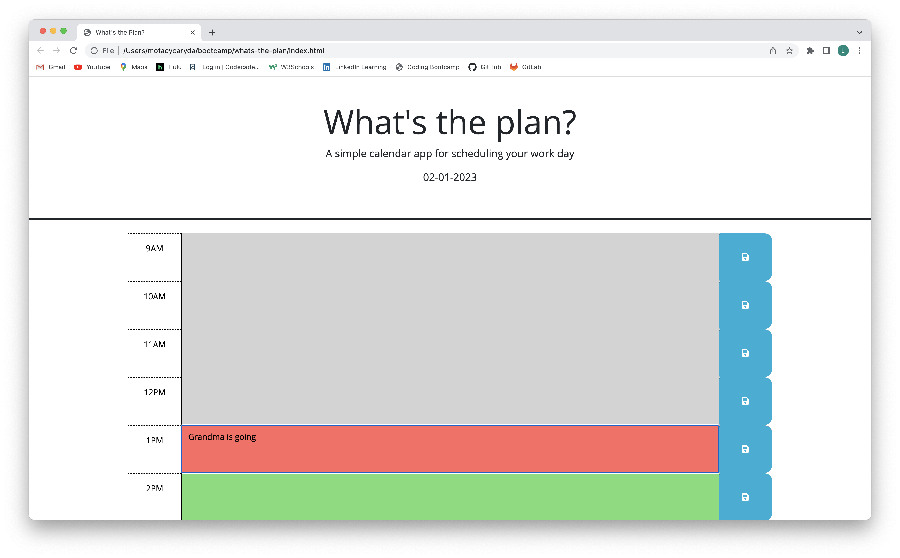
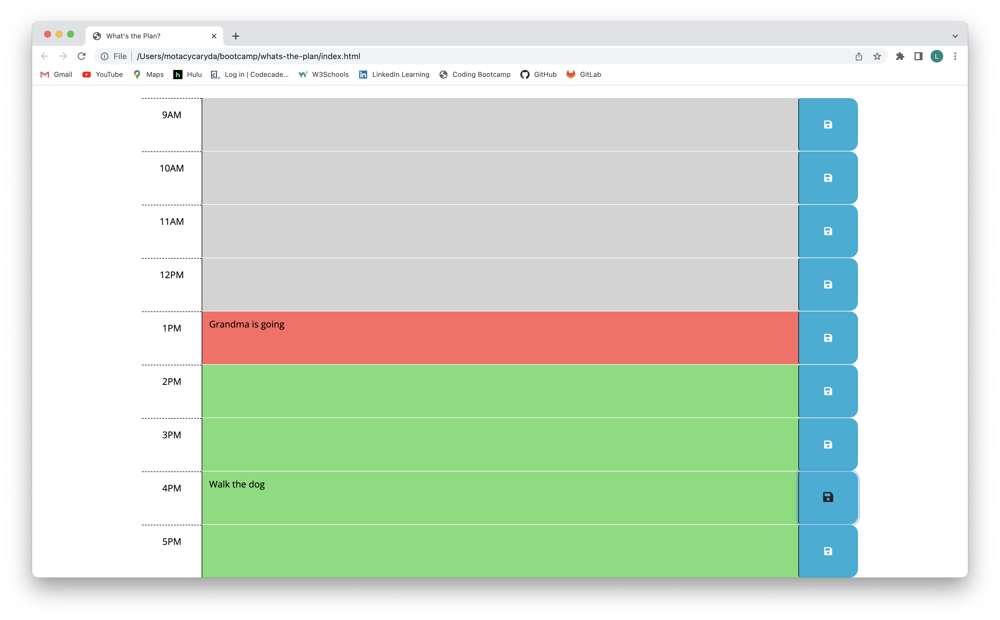
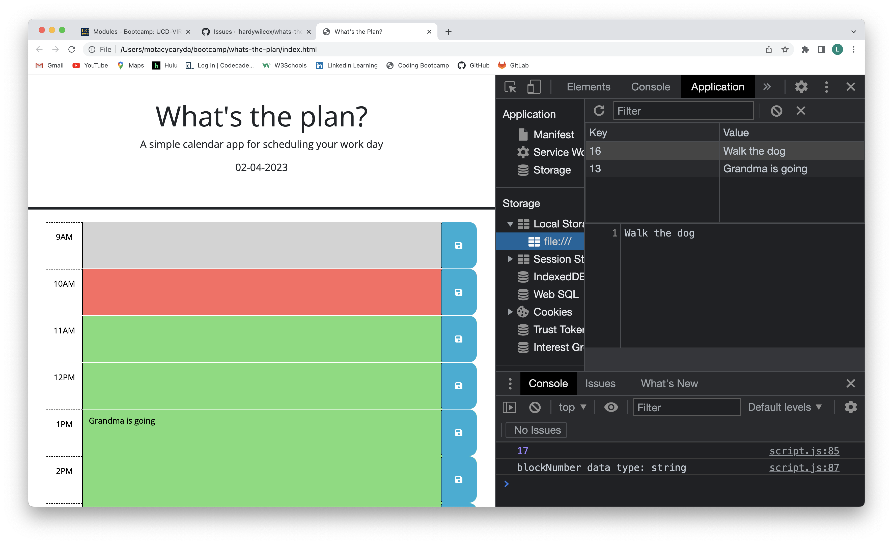

# whats-the-plan
A daily planner project for bootcamp.

## Description
The goal of the project was to extend some starter code, and add some functionality using JQuery and Javascript to create a daily planner where tasks could be entered into the hour blocks and retained for future reference.  It also reflects the progress through the day by changing color styling with the time. This is a quick reference tool users can use to organize their daily tasks.

The challenge for me in this project is understanding how to use JQuery and Javascript better.  It feel like I barely understand Javascript, and needed to learn an additional syntax right away.  The .each and $(this) references are difficult for me to grasp easily.  One of the problems I solved was situation in my conditionals where I was comparing a number to a string and used === instead of ==.  Another very practical lesson learned!

I also had some practice incorporating some information from day.js into the code.

One change I would consider for the future, and for my own use of the app, would be to add code to save the current day as well, so I could clear Local Storage automatically if the current day was different than the saved day.  That is a change I would like, but may not work for all users.

## Usage
On screen today's date is shown at the top of the schedule, the schedule is broken into normal working hours.  The hours are color coded for past, present and future, and those colors will change when the browser if refreshed based on the current hour.  The user is able to enter tasks into each hour's block, and click the save button to the right side of the block to save their tasks.  If the browser is closed, the tasks will persist when reopened.

### Screenshots:

### Deployment Link:

https://lhardywilcox.github.io/whats-the-plan/

## Credits
I received some help from a tutor with this project.  He helped clarify the difference between using .text and .val in the code, as well as helping me understand how to manipulate the different items with a loop.

The starter code for this project is ©2023 edX Bootcamps.

## License
MIT License